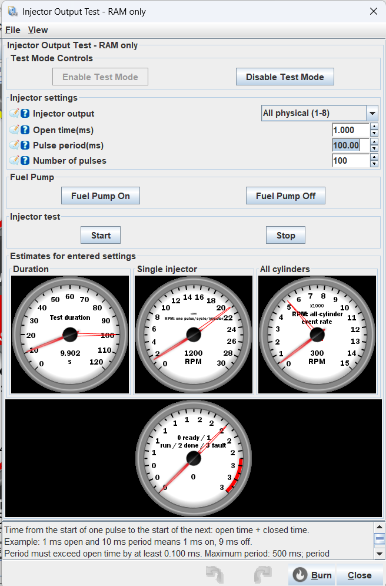
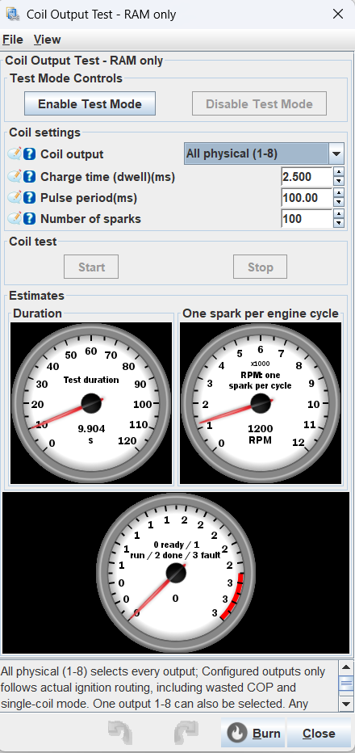
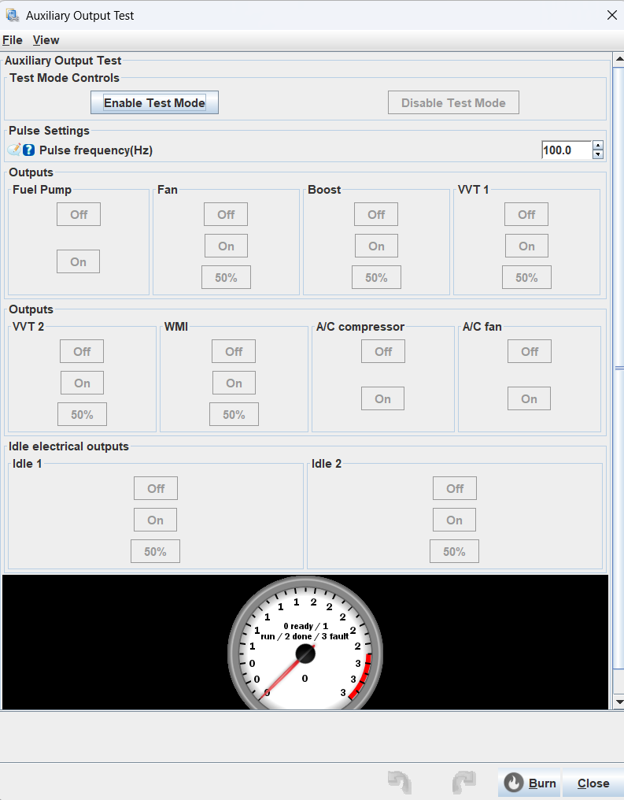
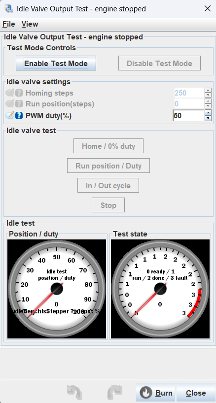

# Levin STM32F407 output bench (bench8)

Experimental native USB CDC build based on upstream master `45d5df11`, on branch
`feature/stm32-output-bench`. Environment: `levin_F407VE_bench`. Matching signature:
`speeduino 202504-levinbench8`. Use the matching INI from this build, not the older Pazzi package.

All four tester dialogs are ported to current pin objects, direct injector/coil
I/O, schedule state, decoder callbacks and output telemetry. The feature is
compile-time opt-in; normal builds retain their original tester.

The tester uses the existing official Levin board mapping (14). No board pin
mappings are changed. The mapping fixture checks the assignments used by the tests.

Use a separate TunerStudio project with this INI. This is a newer development
firmware, not a drop-in 2025.01 tune definition. Back up the working tune and
calibrations before flashing, import/review settings with this definition, and
select `Levin` (board 14) and verify pin selections, idle type and coil polarity before testing.
Do not use the Pazzi INI or assume the two firmware versions share tune layout.

## Build

```powershell
powershell -ExecutionPolicy Bypass -File tools/build_levin_bench.ps1
```

Files are packaged in `.build/levin-bench`: firmware.bin,
firmware.elf, levin-bench.ini, this guide and checksums. Nothing is flashed.
TIM7 is reserved for precision pulses; TIM11 supplies the millisecond tick.

## Controls

Each Hardware Testing dialog has Enable / Disable at the top. Enable requires
engine stopped, no pending schedules or trigger logging, board mapping 14, and
at least five seconds since boot. Only one tester can be enabled at a time.
Enable pauses normal main-loop engine control. Commands cannot activate outputs
before Enable. Closing a tester requests Disable using INI `clickOnClose`.

Stop ends the current sequence and turns its outputs off, keeping test mode
enabled. Disable restores normal ECU control; normal control may operate outputs
again. Completed injector/coil/stepper sequences can be restarted while enabled.
After a fault, Disable is required before enabling again. Reboot starts disabled.

Crank/cam transitions abort outputs immediately. Two seconds without live-data
or status polling also abort. A fault disarms actions but retains ownership and
inhibits normal engine control until Disable. Reconnection never restarts a test.
Precision pulses additionally abort on a late (>25 us) or stalled timer ISR.

### Injector and coil

Defaults are All physical (1-8), 100 ms period and 100 events for both testers;
injector open time is 1 ms and coil dwell is 2.5 ms. Settings reset at reboot.

Select **All**, **Configured outputs only**, or physical output 1-8.
All pulses all eight outputs in the same timer event; GPIO writes have small
sequential execution skew. Count is per output. Every selected pin must pass
collision checks, otherwise the whole request is rejected.

Injector open time: 0.100-20.000 ms. Coil dwell: 0.100-5.000 ms with period at
least 10 ms. Both require at least 0.100 ms closed time, period <=500 ms and count 1-65535. Requested period times count <=120 s.
No dead-time, dwell-voltage or fueling corrections are added. Coil polarity
follows the tune; no constant-on coil command is provided.

Pulse period includes open and closed time: 1 ms open / 10 ms period gives
9 ms closed. Duration is `(1 + (count - 1) * period + open) / 1000` seconds:
1 ms initial delay, no final closed interval. 1000 pulses at 1/10 ms take
9.992 seconds. Entered settings apply to the next sequence.

RPM gauges illustrate one event per engine cycle and aggregate cylinder event
rate. They do not simulate engine operation or firing order. All does not turn
simultaneous pulses into sequential injection/ignition.

The injector dialog has a separate Fuel Pump box. Pump can run before/during
a sequence; Off affects the pump alone. Completion, Stop, Disable, a fault or
120 seconds continuous pump operation switches it off. Repeated On does not
extend that timeout.

### Auxiliary outputs

Fuel pump, A/C compressor and A/C fan: On/Off. Fan, boost, VVT1 and VVT2:
On/Off/50%. Multiple columns work simultaneously. Off affects only that column.
There is no 30-second AUX limit; communication and engine interlocks remain.

Shared pulse frequency is 1.0-200.0 Hz. Change it then press a 50% button to
apply it to every pulsed output. Duty is fixed at 50%. A 1 ms phase accumulator
produces fractional mean frequencies by alternating adjacent tick lengths;
individual edges have millisecond quantization. Choose a frequency appropriate
for the load. Normal PWM cannot overwrite claimed pins. Unselected PWM channels continue their ISR behavior; the VVT adapter preserves logical phase tracking while blocking physical writes to owned outputs.

### Idle valve

Uses the tune's existing PWM/stepper algorithm. Home, Run and In/Out Cycle
require Enable. Idle tests retain their 30-second limit.

Stepper Home moves toward the closed stop for 1-765 steps. Run first homes,
then moves to 0-255 steps, below home count and within configured maximum
travel. Cycle alternates zero and the selected position with 1 s at each end.
STEP time, cooling and direction follow the tune; zero STEP time is rejected,
zero cooling uses 1 ms. DIR has 1 ms setup. Position is estimated, not measured.
Interrupted homing/high STEP makes position unknown; normal control rehomes
on release. Stop lowers STEP and disables the driver.

The disabled secondary-fuel input no longer falsely reserves the stepper DIR
pin (PB10 / Arduino 25). It is checked when input-switched fuel mode is active;
the same rule applies to secondary ignition input.

PWM idle uses 100 Hz, 0-100% duty, single or complementary dual outputs. Both
electrical outputs are LOW on Stop/fault. Home means zero requested duty; Run
holds duty; Cycle alternates it and zero. The single gauge displays estimated
steps or duty according to algorithm and is gated to the idle test session.
Homing reads zero until the reference is established.

## RAM and protocol

Relative to this upstream revision, the original 15 pages and EEPROM layout are unchanged. Page 16 contains 24
transient bytes; empty burn command, noMsqSave and controllerPriority. Test
settings reset at reboot. Stock reference/speeduino.ini is not modified.

CRC-framed payload prefix N, little-endian U16 values:

| Opcode | Operation |
|---|---|
| 00 | Disable / release (always accepted) |
| 01 | Start injector sequence |
| 02 | Status / renew 2 s lease |
| 03 offset:u16 length:u16 | Read RAM settings |
| 04 offset:u16 length:u16 data | Stage RAM settings |
| 05 | RAM settings CRC32, big-endian response |
| 06 target:u8 mode:u8 | AUX: 0 Off, 1 On, 2 50% |
| 07 | Start coil sequence |
| 08 state:u8 | Injector-session pump |
| 09 mode:u8 | Idle: 0 Home, 1 Run, 2 Cycle |
| 0A kind:u8 | Enable: 1 injector, 2 coil, 3 AUX, 4 idle |
| 0B | Stop current test, retain enabled session |

Settings U16 offsets: 0 injector selection (0 All physical, 1-8 individual, 9 configured), 2 open us, 4 period in 10 us units,
6 count; 8 coil channel, 10 dwell us, 12 period in 10 us units, 14 count; 16 homing steps,
18 run position, 20 duty percent; 22 AUX frequency in tenths Hz.
AUX targets: 0 pump, 1 fan, 2 boost, 3 VVT1, 4 VVT2, 5 WMI (shared VVT2 PWM plus WMI enable), 6 AC compressor, 7 AC fan, 8 Idle1, 9 Idle2.

N02 response: result:u8, version:u8 (=8), state:u8, reason:u8, channel:u16,
on-us:u16, period-10us:u16, requested:u16, completed:u16, owned:u8. State: 0 idle,
1 waiting/off, 2 on, 3 complete, 4 aborted. Reasons: 0 none/manual stop,
1 link timeout, 2 trigger, 3 late ISR, 4 stalled timer, 5 pump timeout.
Timing/count fields describe injector/coil sequences, not AUX/idle.

Telemetry byte39: bits0:1 enabled kind minus one, bit2 owned, bit3 running,
bit4 complete, bit5 fault, bit6 enabled. Kind is meaningful only when enabled.
Byte38 holds estimated idle steps/duty during idle testing. Packet size unchanged.
The normal decoder is restored on Disable. Secondary-trigger VSS/flex sharing
is rejected for this target, since both PD3 and PD4 are used for aborts.

## Verification

```powershell
python tools/test_injector_bench.py
python tools/test_bench_ini.py
```

Host tests compile the actual controller against fake GPIO/timers with g++.
They cover Enable gating, single/All outputs, independent concurrent AUX,
frequency, extended AUX runtime, pump, trigger/link/timer faults, stepper pin
regression and dual PWM shutdown. INI tests check fields, page commands,
panel order and menu controls. Hardware waveforms and connected TunerStudio
behavior still require validation; automated checks do not establish physical
pulse accuracy. No connected outputs were actuated during development.

Start with disconnected injectors/coils and suitable dummy loads and a scope.
Fuel-flow tests require a separate bench, not injectors installed in an engine.
Coils need suitable grounded spark loads and appropriate dwell. Verify Disable,
window close, crank/cam abort and USB loss before using actual loads.

Long closed intervals are split across 16-bit TIM7 updates without additional output edges. Period resolution is 0.01 ms; open time remains 0.001 ms. 120 ms means 1000 RPM per injector on a four-stroke engine, 240 ms means 500 RPM. At 500 ms, maximum count is 240 because the 120 s sequence limit remains.

## Feature interlocks (bench8)

AUX buttons and firmware commands require the corresponding tune feature:
fan On/Off or PWM, boost enabled, VVT1 enabled, VVT2 enabled with VVT1 and
without WMI, WMI enabled without VVT2, A/C enabled, and stand-alone A/C fan
enabled along with A/C. Fuel pump has no separate enable setting.

The WMI column provides Off / On / 50%. It owns the shared VVT2 PWM pin and
holds the configured WMI enable output high during On/50%. Off drops both;
other active AUX channels are unaffected. Disable, trigger abort and link loss
also drop both. Both pins must pass conflict checks before either is driven.
The tank-empty input and indicator are not actuated by this test.

Idle Enable is rejected for None/On-Off/invalid algorithms. Only the selected
PWM or stepper controls are available, and firmware checks the algorithm too.
Stop/Disable remain available to release an owned session. Configuration writes
are blocked during an owned session; Disable before changing feature settings.

## Output selection and pin reuse (bench8)

Injector and coil selectors provide All physical (1-8), individual 1-8, and
Configured outputs only. The latter resolves physical channels from the actual
active scheduler callback routing, including paired/semi-sequential injection,
staged injectors, wasted COP and single-coil mode. Unknown callback routing is
rejected instead of guessing from cylinder count. It selects configured outputs,
not the set currently flowing fuel (fuel cuts and staging load thresholds do
not remove configured channels). Count remains per physical selected output.

Every selected injector/coil pin is checked before any output is changed. A
conflict rejects the entire selection, including All; no silent skipping.
The check covers enabled AUX/idle functions, protected inputs, programmable
outputs, second O2, knock and local AUX inputs, and aliases between injector/ignition pins. This is bench admission
validation, not a replacement for normal engine pin configuration validation.

An unused injector/coil output can be reused for AUX. AUX rejects pins belonging
to the configured engine outputs; it no longer reserves all eight blindly.
Example: engine uses injector1-4, fan uses injector8's pin. Injector8 and All
physical are rejected, Configured outputs only tests 1-4, and AUX Fan works.
If injector8 is also used by the engine, both conflicting tests are rejected.

Idle1 and Idle2 columns provide independent electrical Off/On/50% operations
with the shared AUX frequency. On is HIGH and Off is LOW, independent of valve
movement direction. They require PWM idle; Idle2 also requires the two-output
setting. These pins are not stepper driver coils. Normal idle PWM cannot
rewrite a claimed output; the other pin retains its normal PWM phase behavior.
Dedicated valve Home/Run/Cycle testing remains in the separate idle dialog.
Both AUX idle outputs are de-energized on Disable, trigger or communication loss.

## TunerStudio screenshots

These are the original screenshots from testing on the Levin ECU. The idle
screenshot predates the gauge-label fix; the current INI uses a static
position/duty label instead of displaying the unit expression literally.





